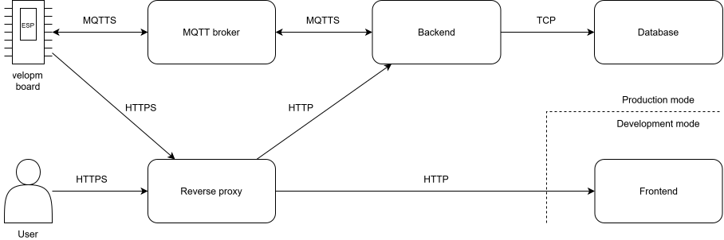

# ESP Manager

*ESP Manager* is a web-based platform for distributing and managing firmware on
ESP-based boards. Firmware developers can publish compiled
firmware together with a configuration file defining variables that end users can set.
Board users can register and operate a board, then install or update firmware
remotely without installing
[ESP-IDF](https://github.com/espressif/esp-idf) or writing firmware themselves.

The repository contains three related projects:

- [`webapp/`](webapp/) - frontend, backend, database, MQTT broker,
  and reverse proxy, orchestrated with Docker Compose.
- [`esp_manager/`](esp_manager/) - an ESP-IDF component used by application
  firmware to manage Wi-Fi, MQTT communication, and OTA updates.
- [`default_app/`](default_app/) - the minimal default firmware used when no
  user firmware is selected.

## Architecture

The browser communicates with the web application through the reverse proxy.
The backend stores users, boards, and firmware metadata in the database. It
stores firmware and generated configuration images under
[`webapp/backend/data/`](webapp/backend/data/).
MQTT, provided by [Mosquitto](https://mosquitto.org/), carries commands and
status messages between the backend and registered boards. Firmware and
configuration images are fetched by the board over HTTPS during an OTA
operation.



The initial registration uses the browser's
[Web Serial API](https://developer.mozilla.org/en-US/docs/Web/API/Web_Serial_API)
to write the default firmware, partition table, bootloader, and configuration
to the board. After registration, the board communicates with the backend
through MQTTS and HTTPS.

## Installation

### Prerequisites

The deployment requires Docker Engine and Docker Compose. Clone the repository
and enter the web application directory:

```sh
git clone https://github.com/radimvalis/ESP-Manager.git
cd ESP-Manager/webapp
```

### Certificates

The web application expects TLS certificates at these paths:

- [`webapp/reverse-proxy/certs/server.crt`](webapp/reverse-proxy/certs/server.crt)
- [`webapp/reverse-proxy/certs/server.key`](webapp/reverse-proxy/certs/server.key)
- [`webapp/mqtt-broker/certs/broker.crt`](webapp/mqtt-broker/certs/broker.crt)
- [`webapp/mqtt-broker/certs/broker.key`](webapp/mqtt-broker/certs/broker.key)
- [`webapp/ca-bundle/ca-bundle.crt`](webapp/ca-bundle/ca-bundle.crt)

The first two pairs are used by the reverse proxy and MQTT broker. The CA
certificate that signed the server certificates must be stored in the last file.

### Environment

Before deployment, edit variables in [`webapp/.env`](webapp/.env) and set at
least the following:

- `HOST` to the host address reachable by the boards.
- `MQTT_ADMIN_PASSWORD`, `DATABASE_PASSWORD`, `DATABASE_ROOT_PASSWORD`,
  `ACCESS_TOKEN_SECRET`, and `REFRESH_TOKEN_SECRET` to long random secrets.

### Start the application

Make the startup script executable:

```sh
chmod +x start.sh
```

For development, use the Vite development server and source-code mounts:

```sh
./start.sh --dev
```

For production, use the production compose configuration:

```sh
./start.sh
```

## Firmware developer manual

### Create a compatible firmware project

User firmware must be compiled with ESP-IDF and must initialize [`esp_manager`](esp_manager/).

To start a new ESP-IDF project, run:

```sh
idf.py create-project <my_project_name>
```

Configure the generated `CMakeLists.txt` file to use `esp_manager`:

```cmake
cmake_minimum_required(VERSION 3.16)
set(EXTRA_COMPONENT_DIRS /path/to/ESP-Manager/esp_manager)
include($ENV{IDF_PATH}/tools/cmake/project.cmake)
project(my_firmware_name)
```

Set the target architecture:

```sh
idf.py set-target esp32
```

The application must initialize `esp_manager`. A minimal compatible application
looks as follows:

```c
#include "esp_manager.h"

void app_main(void)
{
    esp_manager_client_handle_t client = esp_manager_init();
    esp_manager_start(client);

    // Your code ...
}
```

Do not modify the Wi-Fi connection managed by the client. The application may
use the connection after initialization, but it must keep the client running
so that MQTT commands and OTA updates continue to work.

Build the firmware before uploading it to the web application:

```sh
idf.py build
```

### Write a configuration file

A configuration file is a non-empty JSON array. Each item describes one NVS
key and must contain `key`, `type`, `encoding`, `isRequired`, and `label`. The
format is defined by the JSON Schema in the
[configuration schema](webapp/backend/data/default/config-form.schema.json).

Example configuration file:

```json
[
  {
    "key": "sensitivity",
    "type": "data",
    "encoding": "string",
    "isRequired": true,
    "label": "Sensitivity",
    "options": ["low", "medium", "high"]
  },
  {
    "key": "timeout",
    "type": "data",
    "encoding": "i32",
    "isRequired": true,
    "label": "Timeout in seconds",
    "minimum": 1,
    "maximum": 60
  }
]
```

### Read configuration

The configuration is stored in the NVS partition named `config` and its
namespace named `esp_manager`.

The following example reads the configuration from the previous section:

```c
#include "esp_manager.h"
#include "nvs_flash.h"

void app_main(void)
{
    // Initialization of ESP Manager
    esp_manager_client_handle_t client = esp_manager_init();
    esp_manager_start(client);

    // Open NVS partition with stored configuration
    nvs_flash_init_partition("config");
    nvs_handle_t nvs_handle;
    nvs_open_from_partition("config",
                            "esp_manager",
                            NVS_READONLY,
                            &nvs_handle);

    // Read configuration
    size_t size;

    char* sensitivity;
    nvs_get_str(nvs_handle, "sensitivity", NULL, &size);
    sensitivity = malloc(size);
    nvs_get_str(nvs_handle, "sensitivity", sensitivity, &size);

    int32_t timeout;
    nvs_get_i32(nvs_handle, "timeout", &timeout);

    // Use configuration ...
}
```

## Board user manual

### Register a board

1. Open the application in a browser and sign in or create an
  account.
2. Open the boards section and choose **New board**.
3. Connect the board with a data-capable USB cable and choose its serial port.
4. Enter a board name, Wi-Fi SSID, and Wi-Fi password.
5. Choose **Register** and keep the board connected until flashing finishes.

Registration writes the default firmware and board-specific configuration to
the board. Once flashing finishes, the board can be disconnected and moved to
its operating location.

### Flash firmware

The board must be online and must not already be updating.

1. Choose **Flash board**.
2. Select an eligible board.
3. Search for firmware by its identifier and select it.
4. Complete the generated configuration fields if a configuration file is
  provided.
5. Choose **Flash**.

The backend sends an MQTT command to the board. The board downloads the
firmware over HTTPS, writes the optional NVS image, restarts, and reports the
result. If the update fails, the previous firmware remains active.